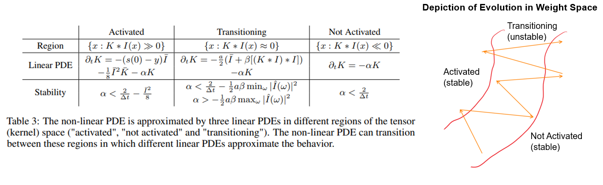

 Surprising Instabilities in Training Deep Networks and a Theoretical Analysis (NeurIPS 2022)
---
Created by [Yuxin Sun](https://www.linkedin.com/in/yuxin-sun-972960140/), [Dong Lao](https://www.linkedin.com/in/lao-dong-97b338b0/), [Ganesh Sundaramoorthi](http://www.ganeshsun.com/index.html) and [Anthony Yezzi](https://ece.gatech.edu/directory/anthony-joseph-yezzi) from [Georgia Tech](https://www.gatech.edu/), [UCLA](https://www.ucla.edu/) and [Raytheon Technologies](https://www.rtx.com/).

__[NeurIPS page](https://proceedings.neurips.cc/paper_files/paper/2022/hash/7b97adeafa1c51cf65263459ca9d0d7c-Abstract-Conference.html) / [Arxiv](https://arxiv.org/abs/2206.02001)__



## Introduction
This repository contains source code for the NeurIPS 2022 paper "Surprising Instabilities in Training Deep Networks and a Theoretical Analysis".
We provide the code for producing experimental data, analyzing results and generating figures.

Please follow the installation instructions below.

## Instructions

### 1. Requirements

Our codebase uses [PyTorch](https://pytorch.org/).
The code was tested with Python 3.7.9, torch 1.8.0 on Ubuntu 18.04 (should work with later versions).

###  2. Simulation of the discretization scheme for the heat PDE

We implemented a demo code for illustration of instability in discretizing the heat equation (`heat.py`). 
It plots the variable `u` at different time.

Set `dt = 0.4` it generates a plot for stable evolution.

Set `dt = 0.8` it generates a plot for unstable evolution.


### 3. Evidence of Instability in Training Deep Networks
In folder `./instabillity`, we include the code for providing empirical evidence of restrained instabilities in current deep learning training practice. 
#### 3.1 Perturbed SGD on Common CNNs

We provide the code for showing final test accuracy over different seeds (batch selections) and different floating
point perturbations (rows) for Resnet56 trained on CIFAR-10. It generates the data for Table 1(left) in section 4.2. 
We provide ResNet56 with two activation functions, ReLU and Swish. Run:
```./instabillity/main6.py```

Different seeds could be chosen by changing `r` in the arguments.

We also provide data analysis code for this experiment in `./scripts/mean_variance.py`. It computes the final accuracy and standard deviation for input data.

#### 3.2 Demonstration of Restrained Instabilities

We provide the code for showing the divergence phenomenon in network weights between the original SGD weights, and the perturbed SGD weights.
It generates the data for two plots in Figure 2. Run:
```./instabillity/main2.py```

Different learning rate divisor could be chosen by changing `n` in the arguments.

We also provide code for producing those figures, `./instability/compute_iterationm` for Figure 2(left) and `./instability/compute_onelayer.m` for Figure 2(right) in section 4.2.

### 4. PDE Stability Analysis of a Simplified CNN
In folder `./single_layer`, we include the code for experiments on a single layer network.
#### 4.1 Empirical Validation of Stability Bounds for Linear PDE
We provide code to validation two stability bounds for the linearized PDE (9). It generates the loss plots for the
discretization of lineared PDE (9). Run:
```./sinlge_layer/linear.py```

We also provide code for producing the Figure 3 in `./scripts/loss_plot.py`.

#### 4.2 Restrained Instabilities in the Non-linear PDE
We provide the code for showing that restrained instabilites are present in the (non-linear) gradient descent PDE of the one layer CNN.
It generates the loss plots for the non-linear PDE (8) for various choices of learning rates (dt). Run:
```./single_layer/PySun.py```

We also provide code for producing the Figure 4 (left) in `./scripts/oscillation_plot.py`.

#### 4.3 L1 error accumulation in the non-linear PDE
We provide the code for showing error amplification occurs in the (non-linear) gradient descent PDE of the one layer CNN.
It generates the data for Figure 4(right). Run:
```./single_layer/PySun2.py```

## Thanks

This research was supported in part by Army Research Labs (ARL) W911NF-22-1-0267 and Raytheon
Technologies Research Center.

## License and Citation

If you find our work useful in your research, please cite our paper:

[Preprint](https://arxiv.org/abs/2206.02001):
```bibtex
@inproceedings{NEURIPS2022_7b97adea,
 author = {Sun, Yuxin and LAO, DONG and Sundaramoorthi, Ganesh and Yezzi, Anthony},
 booktitle = {Advances in Neural Information Processing Systems},
 editor = {S. Koyejo and S. Mohamed and A. Agarwal and D. Belgrave and K. Cho and A. Oh},
 pages = {19567--19578},
 publisher = {Curran Associates, Inc.},
 title = {Surprising Instabilities in Training Deep Networks and a Theoretical Analysis },
 url = {https://proceedings.neurips.cc/paper_files/paper/2022/file/7b97adeafa1c51cf65263459ca9d0d7c-Paper-Conference.pdf},
 volume = {35},
 year = {2022}
}
```

See [LICENSE](LICENSE) file.